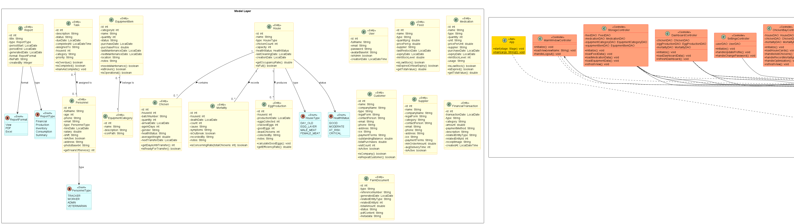
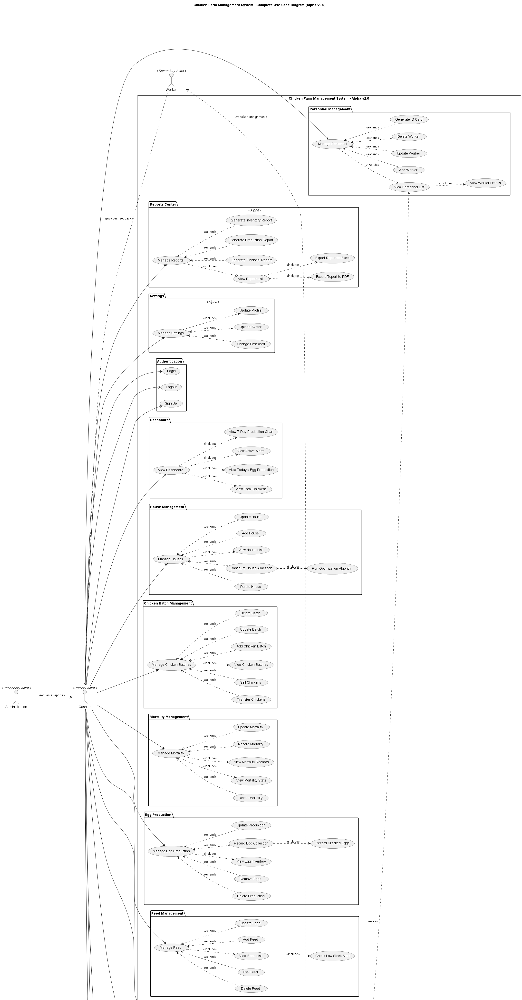
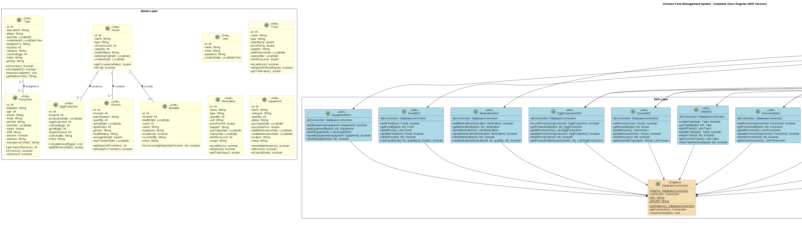

# 🐔 Chicken Farm Management System (Alpha v2.0)

> A comprehensive, enterprise-grade desktop application for modern poultry farm management, built with Java and JavaFX.
> **Current Status:** Service-Ready Alpha Version

[](https://www.oracle.com/java/)
[](https://openjfx.io/)
[]()
[]()
[](LICENSE.txt)

---

## 👥 Team Members

This project was architected and developed by the following team:

| Name                     | Role                                  | GitHub |
|--------------------------|---------------------------------------|--------|
| ELFADILI MOHAMED YACINE  | Chef de Projet (Project Lead) & Full Stack  | [@Medfadili20Dev](https://github.com/Medfadili20Dev) |
| HAMMOU MOHAMED           | Développeur Backend / Base de Données | [@Hmou05](https://github.com/Hmou05) |
| ANSSEM HAFID             | Développeur Frontend / JavaFX         | [@ANSS77](https://github.com/ANSS77) |
| HAIFI MOHAMED AMINE      | Testeur / Documentateur               | [@Mohamadaminehaifi](https://github.com/Mohamadaminehaifi) |
| OUCHRAA ISMAIL           | Architecte Logiciel / Design Patterns | [@ismailouchraa](https://github.com/ismailouchraa) |

### 👨‍🏫 Supervising Professors
- **Youssef ES-SAADY**
- **Abderrahmane SADIQ**
- **AICHA DAKIR**

---

## 📋 Project Description

The **Chicken Farm Management System** is a powerful ERP (Enterprise Resource Planning) solution designed specifically for the poultry industry. It allows farm managers to digitize every aspect of their operation, from livestock health and egg production to complex financial tracking and supply chain management.

### Key Capabilities
- **360° Farm Visibility**: Dashboard with real-time analytics.
- **Full Digitalization**: Replaces all paper records with a secure database.
- **Financial Intelligence**: Automated P&L (Profit & Loss) analysis.
- **Legal Compliance**: Generation of compliant contracts and internal documents.

---

## 🚀 Application Modules (Alpha Feature Set)

The application is structured into **12 Core Modules**, providing a complete suite of tools for farm management:

### 📊 **1. Executive Dashboard**
- **Real-time KPI Cards**: Total Chickens, Daily Egg Production, Active Alerts.
- **Financial Overview**: Income vs. Expense snapshot.
- **Production Trends**: 7-Day visualization of yield.

### 🏠 **2. Chicken Bay (Livestock)**
- **Multi-House Management**: Track 4 distinct houses (Chicks, Layers, Meat).
- **Lifecycle Tracking**: Monitor age, health status, and transfer dates.
- **Mortality Logs**: digital recording of daily losses with cause tracking.

### 🥚 **3. Eggs Bay (Production)**
- **Daily Collections**: Logging per house/batch.
- **Quality Control**: Track Good vs. Cracked/Broken eggs.
- **Stock Management**: Auto-updating inventory levels.

### 📦 **4. Storage & Inventory**
- **Feed Management**: Track varying feed types (Starter, Grower, Layer).
- **Medication Stock**: Expiry tracking and low-stock alerts.
- **Equipment**: Asset tracking and maintenance status.

### 🤝 **5. CRM (Customer Relations)**
- **Client Database**: Manage profiles for Companies and Individuals.
- **Sales History**: Complete log of visits and purchases.
- **Credit Control**: Track outstanding balances and payment status.

### 🚚 **6. SCM (Suppliers)**
- **Vendor Database**: Centralized supplier directory.
- **Categorization**: Filter by Feed, Meds, Equipment, or Chicks suppliers.
- **Performance Rating**: 5-star rating system for quality assurance.

### 💰 **7. Financial Tracking**
- **General Ledger**: Record of all Incomes and Expenses.
- **Granular Categories**: Feed, Salary, Maintenance, Sales, etc.
- **Profit Analysis**: Real-time Net Profit calculations per period.
- **Transaction History**: Searchable financial archives.

### � **8. Reports Center**
- **Production Reports**: Aggregated performance data.
- **Inventory Reports**: Valuation of current assets.
- **Financial Statements**: P&L reports.
- **Export Formats**: Generate professional **PDF** and **Excel** files.

### 📄 **9. Farm Documents**
- **Document Management System**: Store and manage digital files.
- **Template Engine**: Auto-generate Contracts, Certificates, and Invoices.
- **Versioning**: Track document history (V1, V2...).

### ✅ **10. Task Manager**
- **Digital Work Orders**: Assign tasks to specific workers.
- **Completion Tracking**: Status updates (Pending, Done, Overdue).
- **Prioritization**: Critical vs. Routine tasks.

### 👨‍� **11. Personnel & HR**
- **Staff Directory**: Complete employee profiles.
- **Role Management**: Define responsibilities.
- **ID Card Generator**: Create professional **Photo ID Cards with QR Codes**.

### ⚙️ **12. System Settings**
- **Configuration**: Farm details and parameters.
- **User Management**: Admin controls and access rights.

---

## 🛠️ Technology Stack

We follow a modern, robust architecture to ensure reliability:

- **Language**: Java 17+ (LTS)
- **UI Framework**: JavaFX 25 (Responsive, Modern Design)
- **Build Tool**: Maven
- **Database**: SQLite 3.44.1 (Serverless, High-Perf)
- **Architecture**: MVC (Model-View-Controller)
- **Testing**: **JUnit 5 (195 Tests with 100% DAO Coverage)**
- **Integrations**: `iText 7`, `OpenHTMLToPDF`, `ZXing`, `PDFBox`

---

## 🎨 UML Diagrams

**Location:** `Diagrams_UML/`

### 📥 Download All Diagrams
[Download ZIP file here (Mega link)](https://mega.nz/file/J3MRWDjD#5JkfUPJrHXu_MnDXxbx8sFcwtL4D76Rcml9F7zDLfUY)

---

### 🆕 Alpha v2.0 Diagrams

Complete architecture including CRM, SCM, Financial Tracking, Documents, Reports, and MILP Optimization.

#### 📊 Class Diagram


#### 📋 Use Case Diagram


#### 🔄 Sequence Diagrams
10 sequence diagrams covering: Login, Dashboard, Add Batch, Egg Collection, Add Feed, Create Task, Add Personnel, Add Customer (CRM), Generate Invoice (PDF), House Optimization (MILP).

📂 **Path:** `Diagrams_UML/Alpha_version/Séquences/Images/`

---

### 📦 MVP Diagrams

Original minimal viable product design with core entities.

#### � Class Diagram


#### � Use Case Diagram


#### 🔄 Sequence Diagrams
7 sequence diagrams covering core operations.

📂 **Path:** `Diagrams_UML/MVP_version/Séquences/Images/`

## � Project Folder Structure

A breakdown of the project's source code organization:

```txt
Chicken_Farm_Management_System/
│
├── database/                   # SQLite database file
│   └── farm.db
│
├── src/
│   ├── main/
│   │   ├── java/ma/farm/
│   │   │   ├── controller/     
│   │   │   │   ├── dialogs/
│   │   │   │   │   ├── AddEditEquipmentItemDialogController.java
│   │   │   │   │   ├── AddEditFeedDialogController.java
│   │   │   │   │   ├── AddEditMedicationDialogController.java
│   │   │   │   │   ├── AddEditPersonnelDialogController.java
│   │   │   │   │   ├── AddEditTaskDialogController.java
│   │   │   │   │   ├── AddEquipmentCategoryDialogController.java
│   │   │   │   │   ├── AddHouseDialogController.java
│   │   │   │   │   ├── ConfigHousesDialogController.java
│   │   │   │   │   ├── DistributeChicksDialogController.java
│   │   │   │   │   ├── EditEggProductionDialogController.java
│   │   │   │   │   ├── EditHouseDialogController.java
│   │   │   │   │   ├── ImportChicksDialogController.java
│   │   │   │   │   ├── ManageEquipmentItemsDialogController.java
│   │   │   │   │   ├── PersonnelDetailDialogController.java
│   │   │   │   │   ├── RecordEggCollectionDialogController.java
│   │   │   │   │   ├── RecordMortalityDialogController.java
│   │   │   │   │   ├── SellChickensDialogController.java
│   │   │   │   │   ├── SellEggsDialogController.java
│   │   │   │   │   ├── TransferChickensDialogController.java
│   │   │   │   │   ├── UseFeedDialogController.java
│   │   │   │   │   └── UseMedicationDialogController.java
│   │   │   │   ├── ChickenBayController.java
│   │   │   │   ├── CustomersController.java
│   │   │   │   ├── DashboardController.java
│   │   │   │   ├── EggsBayController.java
│   │   │   │   ├── FarmDocumentController.java
│   │   │   │   ├── FinancialTrackingController.java
│   │   │   │   ├── LoginController.java
│   │   │   │   ├── MainWindowController.java
│   │   │   │   ├── PersonnelController.java
│   │   │   │   ├── ReportsController.java
│   │   │   │   ├── SettingsController.java
│   │   │   │   ├── SidebarController.java
│   │   │   │   ├── SignUpController.java
│   │   │   │   ├── StorageController.java
│   │   │   │   ├── SuppliersController.java
│   │   │   │   └── TasksController.java
│   │   │   │
│   │   │   ├── dao/
│   │   │   │   ├── ChickenDAO.java
│   │   │   │   ├── CustomerDAO.java
│   │   │   │   ├── DatabaseConnection.java
│   │   │   │   ├── DocumentDAO.java
│   │   │   │   ├── EggProductionDAO.java
│   │   │   │   ├── EquipmentCategoryDAO.java
│   │   │   │   ├── EquipmentItemDAO.java
│   │   │   │   ├── FeedDAO.java
│   │   │   │   ├── FinancialDAO.java
│   │   │   │   ├── HouseDAO.java
│   │   │   │   ├── MedicationDAO.java
│   │   │   │   ├── MortalityDAO.java
│   │   │   │   ├── PersonnelDAO.java
│   │   │   │   ├── ReportDAO.java
│   │   │   │   ├── SupplierDAO.java
│   │   │   │   ├── TaskDAO.java
│   │   │   │   └── UserDAO.java
│   │   │   │
│   │   │   ├── model/
│   │   │   │   ├── AdminPosition.java
│   │   │   │   ├── Chicken.java
│   │   │   │   ├── Customer.java
│   │   │   │   ├── DocumentVersion.java
│   │   │   │   ├── EggProduction.java
│   │   │   │   ├── EquipmentCategory.java
│   │   │   │   ├── EquipmentItem.java
│   │   │   │   ├── FarmDocument.java
│   │   │   │   ├── Feed.java
│   │   │   │   ├── FinancialTransaction.java
│   │   │   │   ├── HealthStatus.java
│   │   │   │   ├── House.java
│   │   │   │   ├── HouseType.java
│   │   │   │   ├── Medication.java
│   │   │   │   ├── Mortality.java
│   │   │   │   ├── Personnel.java
│   │   │   │   ├── PersonnelType.java
│   │   │   │   ├── Report.java
│   │   │   │   ├── Supplier.java
│   │   │   │   ├── Task.java
│   │   │   │   └── User.java
│   │   │   │
│   │   │   ├── util/
│   │   │   │   ├── ChickenBayOptimization.java
│   │   │   │   ├── DateUtil.java
│   │   │   │   ├── IdentityCardGenerator.java
│   │   │   │   ├── NavigationUtil.java
│   │   │   │   ├── PDFGenerator.java
│   │   │   │   └── ValidationUtil.java
│   │   │   │
│   │   │   └── App.java
│   │   │
│   │   └── resources/
│   │       ├── css/
│   │       │   ├── dialogs.css
│   │       │   ├── farmdoc-improve.css
│   │       │   └── style.css
│   │       ├── database/
│   │       │   └── schema.sql
│   │       ├── fxml/
│   │       │   ├── dialogs/
│   │       │   │   ├── AddEditEquipmentItemDialog.fxml
│   │       │   │   ├── AddEditFeedDialog.fxml
│   │       │   │   ├── AddEditMedicationDialog.fxml
│   │       │   │   ├── AddEditPersonnelDialog.fxml
│   │       │   │   ├── AddEditTaskDialog.fxml
│   │       │   │   ├── AddEquipmentCategoryDialog.fxml
│   │       │   │   ├── AddHouseDialog.fxml
│   │       │   │   ├── ConfigHousesDialog.fxml
│   │       │   │   ├── DistributeChicksDialog.fxml
│   │       │   │   ├── EditEggProductionDialog.fxml
│   │       │   │   ├── EditHouseDialog.fxml
│   │       │   │   ├── ImportChicksDialog.fxml
│   │       │   │   ├── ManageEquipmentItemsDialog.fxml
│   │       │   │   ├── PersonnelDetailDialog.fxml
│   │       │   │   ├── RecordEggCollectionDialog.fxml
│   │       │   │   ├── RecordMortalityDialog.fxml
│   │       │   │   ├── SellChickensDialog.fxml
│   │       │   │   ├── SellEggsDialog.fxml
│   │       │   │   ├── TransferChickensDialog.fxml
│   │       │   │   ├── UseFeedDialog.fxml
│   │       │   │   └── UseMedicationDialog.fxml
│   │       │   ├── ChickenBayView.fxml
│   │       │   ├── CustomersView.fxml
│   │       │   ├── DashboardView.fxml
│   │       │   ├── EggsBayView.fxml
│   │       │   ├── FarmDocumentView.fxml
│   │       │   ├── FinancialTrackingView.fxml
│   │       │   ├── LoginView.fxml
│   │       │   ├── MainWindow.fxml
│   │       │   ├── PersonnelView.fxml
│   │       │   ├── ReportsView.fxml
│   │       │   ├── SettingsView.fxml
│   │       │   ├── Sidebar.fxml
│   │       │   ├── SignUpView.fxml
│   │       │   ├── StorageView.fxml
│   │       │   ├── SuppliersView.fxml
│   │       │   ├── TasksView.fxml
│   │       │   └── id_card.fxml
│   │       ├── images/
│   │       └── templates/
│   │           ├── identity-card.css
│   │           └── identity-card.html
│   │
│   └── test/java/ma/farm/dao/
│       ├── ChickenBayOptimizationTest.java
│       ├── ChickenDAOTest.java
│       ├── CustomerDAOTest.java
│       ├── DatabaseConnectionTest.java
│       ├── DocumentDAOTest.java
│       ├── EggProductionDAOTest.java
│       ├── EquipmentCategoryDAOTest.java
│       ├── EquipmentItemDAOTest.java
│       ├── FeedDAOTest.java
│       ├── FinancialDAOTest.java
│       ├── HouseDAOTest.java
│       ├── MedicationDAOTest.java
│       ├── MortalityDAOTest.java
│       ├── PersonnelDAOTest.java
│       ├── ReportDAOTest.java
│       ├── SupplierDAOTest.java
│       ├── TaskDAOTest.java
│       ├── UserDAOTest.java
│       └── ValidationUtilTest.java
│
├── Diagrams_UML/               # Contains Alpha_version & MVP_version diagrams
├── pom.xml
└── README.md
```

---

## �💻 Setup & Installation

### Prerequisites Checklist
- [ ] Git installed
- [ ] Java JDK 17+ installed
- [ ] Maven installed
- [ ] IntelliJ IDEA installed
- [ ] JavaFX SDK 25 downloaded

### Installation Guide

1. **Clone the Repository**
   ```bash
   git clone https://github.com/Medfadili20Dev/Chicken_Farm_Management_System.git
   ```

2. **Open in IntelliJ IDEA**
    - File -> Open -> Select Project Folder

3. **Configure JavaFX**
    - Add JavaFX 25 SDK to Global Libraries.
    - Set VM Options:
      ```
      --module-path "/path/to/javafx-sdk-25.0.1/lib" --add-modules javafx.controls,javafx.fxml
      ```

4. **Run the Application**
    - Execute `ma.farm.App` or use Maven:
      ```bash
      mvn javafx:run
      ```

5. **Login**
    - **Email:** `admin@farm.ma`
    - **Password:** `admin123`

---

## 🤝 Contributing

We welcome contributions!
1. Fork the repo.
2. Create your feature branch (`git checkout -b feature/AmazingFeature`).
3. Commit your changes (`git commit -m 'Add some AmazingFeature'`).
4. Push to the branch (`git push origin feature/AmazingFeature`).
5. Open a Pull Request.

---

## 📄 License

This project is licensed under the MIT License - see the [LICENSE.txt](LICENSE.txt) file for details.

---

**Built by the Farm Management Dev Team | University Java Project 2025**
